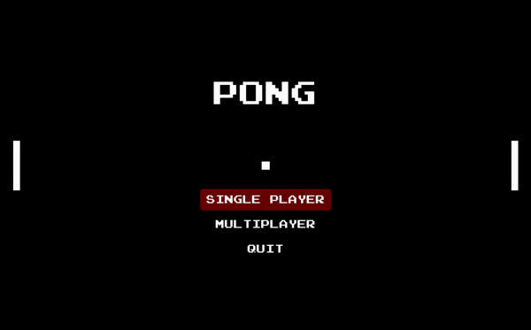

# Pong (2D)

This repository contains a Pong 2D game created using the [Unity Game Engine](https://unity.com/).

> Pong is a table tennis-themed arcade video game, featuring simple two-dimensional graphics, manufactured by Atari and originally released in 1972. It was one of the earliest arcade video games; it was created by Allan Alcorn as a training exercise assigned to him by Atari co-founder Nolan Bushnell, but Bushnell and Atari co-founder Ted Dabney were surprised by the quality of Alcorn's work and decided to manufacture the game. Bushnell based the game's concept on an electronic ping-pong game included in the Magnavox Odyssey, the first home video game console.

  

Standalone applications for Windows, Mac, and Linux can be found in the [Release](https://github.com/FARLY7/unity-pong/releases) section.

## Features

- Both single player and multiplayer modes.
- Computer "AI" in single player mode.
- Scoreboard.
- Pong audio played when ball collides with the paddle.
- Ability to influence the direction of the ball depending on where it hits the paddle. The closer the ball hits the center of the paddle, the more it will leave in a direction perpendicular to the paddle's surface. If the ball hits closer to the edge of the paddle, it will leave the paddle at a more aggressive angle in the direction of the side struck.
- The speed of the ball increases with every surface it collides with.
- Live computer vs computer background game during menu screen.

## Controls

Quit game - <kbd>Q</kbd> or <kbd>ESC</kbd>

**Player 1**
- Move up - <kbd>W</kbd>
- Move down - <kbd>S</kbd>

**Player 2**
- Move up - <kbd>Arrow UP</kbd>
- Move down - <kbd>Arrow DOWN</kbd>